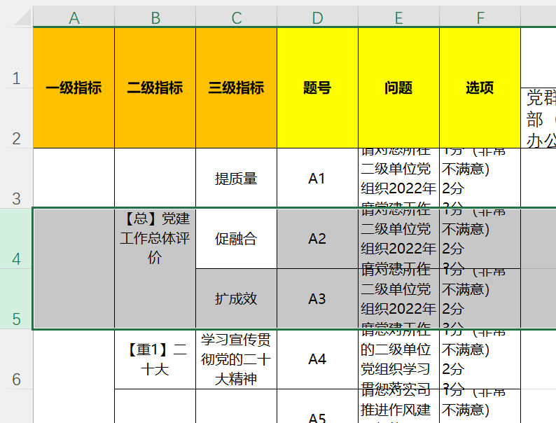

# TODO
自动识别单元格大小, 识别需要删除的行。
自动汇总本单元格数据。

# 目录介绍
- main_xlwings.py  为主程序，调用了其他模块，包括：
- scoreJudge.py  为判断分数是否合格的模块
- shtDataCalc.py 为计算各个sheet的数据的模块
- shtOperate.py 为操作excel的模块, 放置数据，修改格式等
- lib.py 为一些公共函数的模块

 代码处理主要分为两部分：数据计算 & 数据填写
 
## DataModel
```python

sta = ''
staAvg = 'sum(sta)/len(sta)'
staAvgUnit = 'staAvg + staAvg'
staffWithLv = {"lv2_0": {"lv3_0": [sta, sta],
                         "lv3_1": [sta, sta]},
               "lv2_1": {"lv3_0": [sta, sta],
                         "lv3_1": [sta, sta]}
               }

scoreWithLv = {'lv2_0': {
                        'lv3_0': [[9, 4, 4, 5, 6, 5, 10, 6, 8, 8, 8, 10, 6, 4, 7, 0, 4, 10, 10, 10, 7, 10, 4, 5, 8, 8, 4, 6, 8, 8]],
                        'lv3_1': [[10, 10, 10, 10, 10, 8, 10, 10, 10, 10, 6, 10, 8, 10, 10, 0, 10, 8, 10, 10, 10, 10, 10, 10, 10, 10, 10, 10, 10, 10]], 
                        '二级单位': [8.033333333333333]
                    }, 
                'lv2_1': {
                            '主体责任支撑室': [[10, 10, 10, 10, 10, 7, 10, 10, 10, 8, 4, 10, 10, 10, 10, 0, 10, 10, 10, 10, 10, 10, 10, 10, 10, 10, 10, 10, 10, 10]], '二级单位': [9.3]}, '纪委办公室（职能管理部纪委）': {'综合组织室（职能管理部纪委办公室）': [[10, 10, 10, 10, 10, 10, 10, 10, 10, 10, 10, 10, 10, 10, 10, 0, 4, 10, 10, 10, 10, 10, 10, 10, 10, 10, 8, 10, 10, 10]], '二级单位': [9.4]}}

# the data model of sheet
sht1WithLv = {"lv2_0": {"lv3_0": [staAvg],
                        "lv3_1": [staAvg],
                        "二级单位": [staAvg]},
              "lv2_1": {"lv3_0": [staAvg],
                        "lv3_1": [staAvg],
                        "二级单位": [staAvg]},
              }

# 用的时候 需要 * weight
sht2WithLv = {"lv2_0": {"lv3_0": [staAvgUnit],
                        "lv3_1": [staAvgUnit],
                        "二级单位成绩": [],
                        "本线条排名": [],
                        "全公司排名": [],
                        },
              }


sht3WithLv = {"lv2_0": {"lv3_0": [staAvgUnit],}}

sht4WithLv = {"lv2_0": {"lv3_0": [staAvgUnit],}}
```


## 说明
打扰一下各位领导几分钟时间，我是负责本流程的开发工程师孟骏清，我想关于目前的开发进度说明一下。

首先，我要为我自己贸然接下这个本不应该出现在RPA开发需求内的流程致歉，并说明一下目前项目历经的问题，主要有三个方面。
其一，岗位经验问题：在本需求没有人工处理过，没有往期样例的情况下，并且是第一次接触党建Excel处理，也不够熟悉党建，调研不充分，随之而来的也是由于调研不充分没有意识到项目的复杂性, 以及各方配合的重要性。只单凭自己曾经以明确的需求、明确的开发的经验，就揽下了这个被推脱多次的项目。当自己对需求逐渐明确后才理解项目的复杂性。

其二，项目开发问题：党建Excel代码工程量及其巨大，以最近的两个几近交付的项目（制度核查&关键词检查）来看，每个流程用到的代码块10~100行代码，而目前党建excel的核心代码粗略估计已经达到了1800行，若包含测试等代码则至少2200行；
而输入参数在上两个项目里需要2~4个，本党建Excel处理流程目前是约55个输入参数，其中之一的“模板文件”内也有众多数据以备修改. 相应的输入文件，撰写文档这些在由于需要说明的点较少，在其他流程不是事儿的事儿，在这里已经成了一个事儿。

其三，非代码的问题：调研沟通中以开发工程师的视角来理解流程至关重要，这直接关系到程序的质量，而实际在沟通中并没有做到这一点。 另外程序的编写需要大量的测试才能保证质量，也意味着要由不同的输入，及不断地修复不同输入带来的BUG，而这在开发前是完全没有条件可以了解的。


其次，目前完成情况和在做的部分：
模拟数据测试没问题（示例数据压缩包已发送在群内，完成度90%以上）。
在做的部分：目前拿到的新数据以程序视角来看，有大量变化，也有很多是无法适配的地方，比如党建单元内题目数量时常变动，而这些是需要动态获取并处理的，这样的细节问题有很多，这也是因为通过不同的文件测试才能发现的问题。
通过测试得到的问题，需要一一修复排查，这也是目前在做的事情。
担心的是代码庞大后的可维护性：虽然本人python开发已有近3年经验, 代码架构，代码风格，注释，可读性都没有大问题，但我仍担心的是之后本项目的可维护性，一旦输入文件有哪里有变而又没有考虑到，这会使运维和使用出现很多问题。
因此我会尽可能考虑周全的逐步完善自己的作品，使程序足够健壮，正确地应对尽可能多的情况。


再次，虽然本项目的确很多问题，但这并非意味着无法完成，在接下来的时间，仍会尽力开发，完善测试，尽快交付。


最后，希望在接下来的时间，能够得到各位领导对项目大小及复杂程度与开发的理解，谢谢。

2022-9-29
